# Please proceed as follows : 

1. You must have node js installed on computer if not then download it from https://nodejs.org/en/ and choose the LTS version and seen in the image below.  

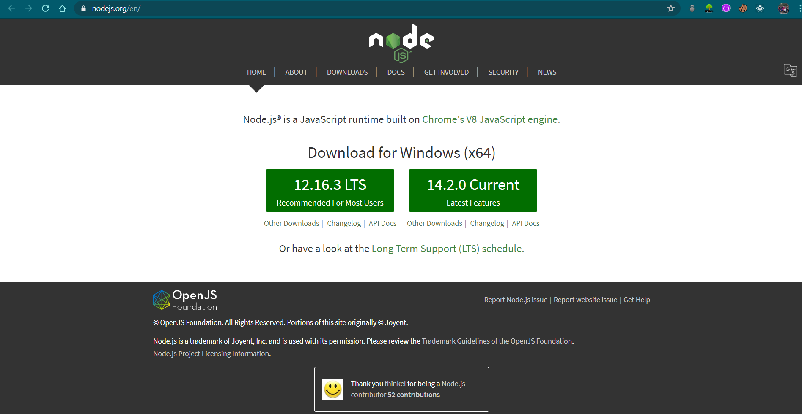

  

2. You must have Git installed on computer if not then download it from https://gitforwindows.org/ and click the download button and seen in the image below.  

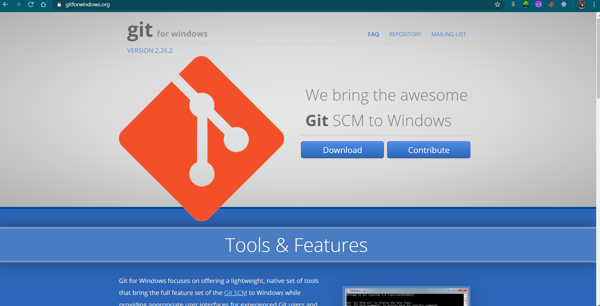

  

3. Open git bash where you want to clone the project  

    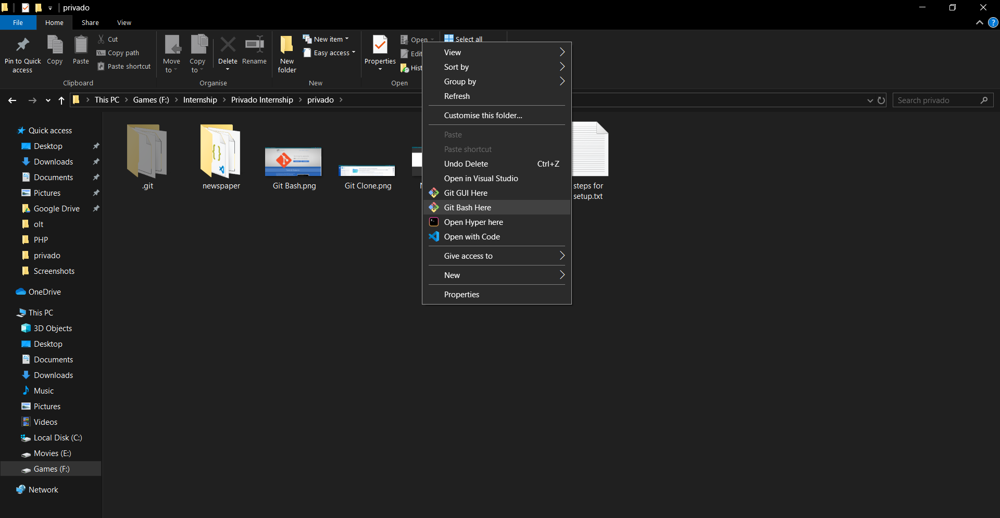
    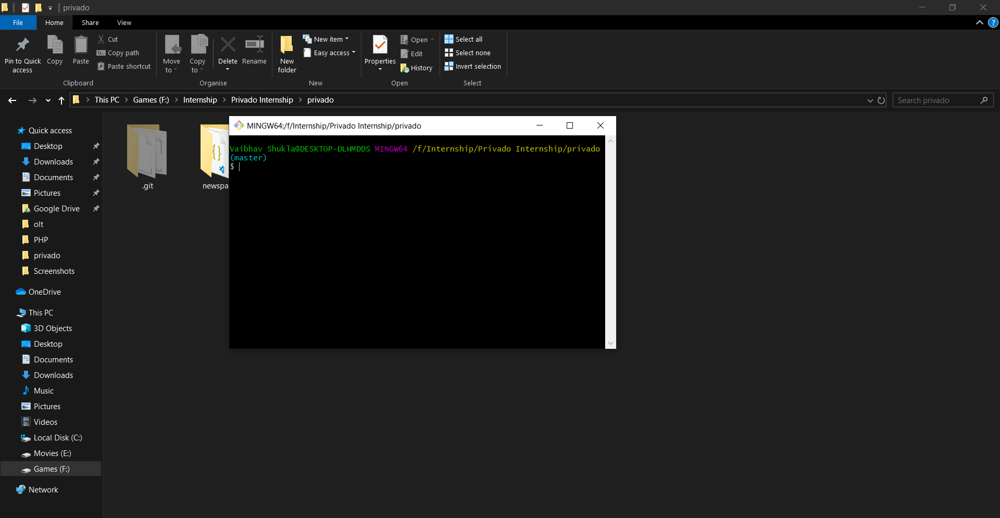

  

4. Now paste the command 'git clone https://github.com/Terminator9530/Newsletter.git' by right clicking the terminal and select paste or use Shift+Ins as seen in image below  

    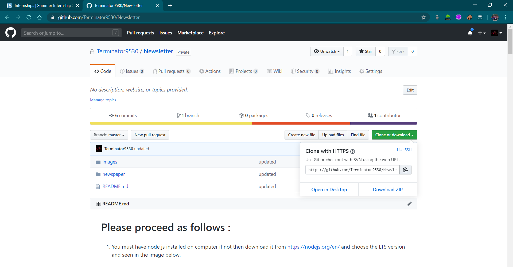
    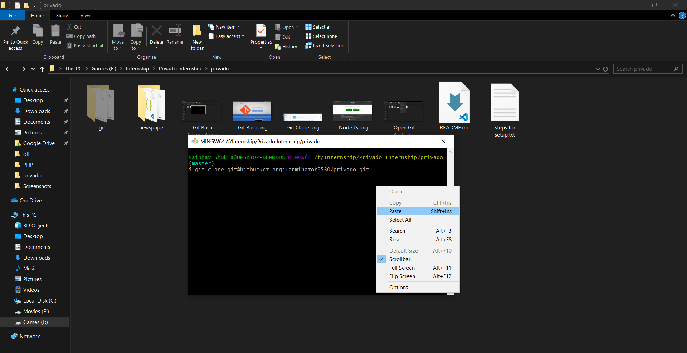

  

5. Open newspaper folder and then open git bash there and run command 'npm i' then it will download all the dependencies  

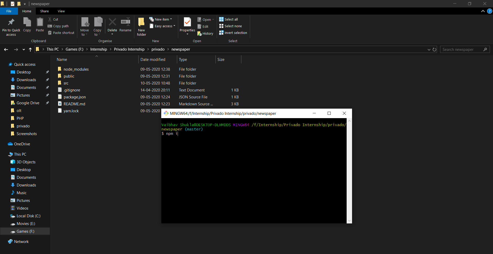

  

6. Now type command 'npm start' to run the project and then browser is opened and you can now see the project  

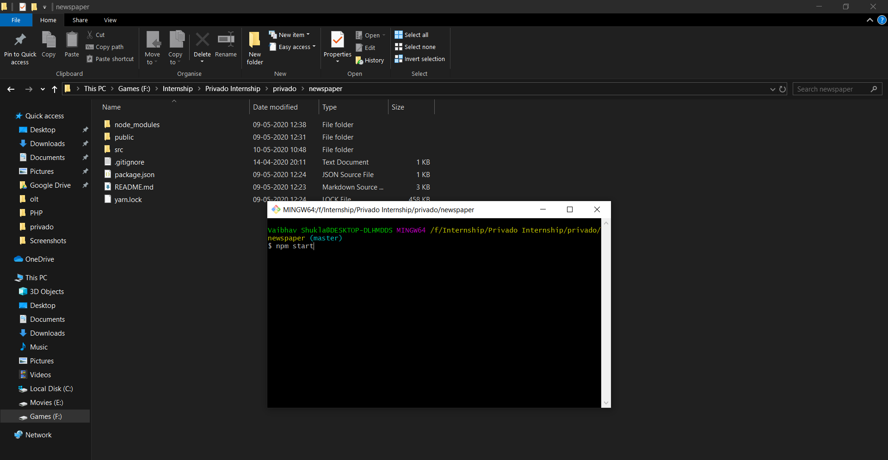

  

7. At last to see project only click link https://objective-liskov-8d7f95.netlify.app/ some screenshots are :   

    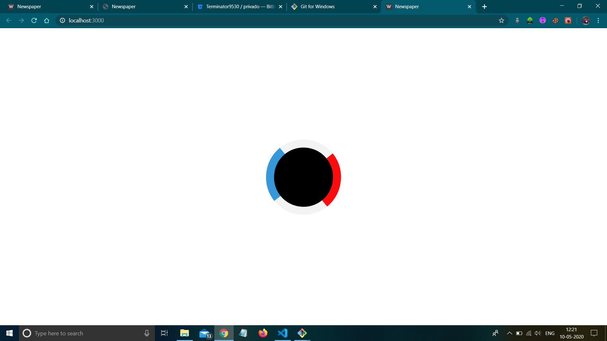
    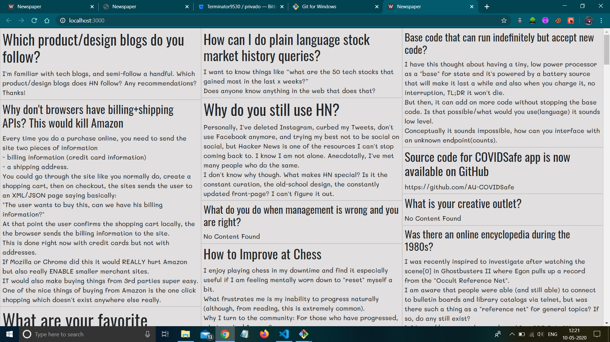
    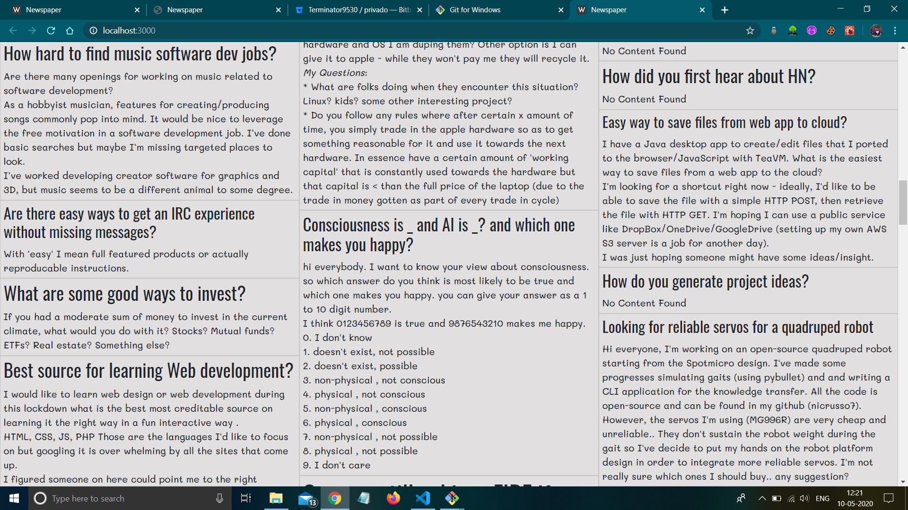
    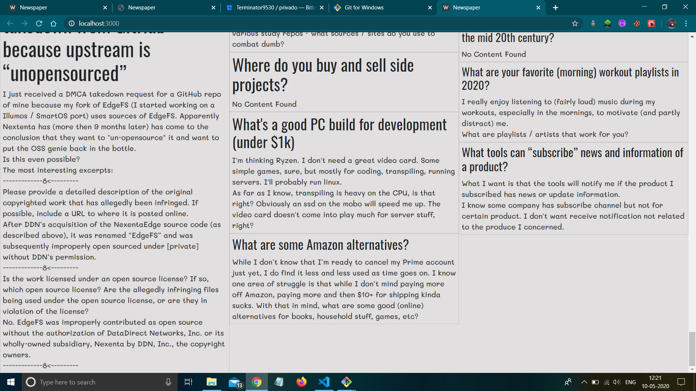

  

<-------------------------------------------------------------THE END----------------------------------------------------------------->